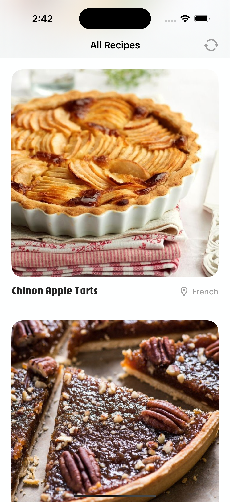

//
//  README.md
//  Recipez
//
//  Created by Laurie Cai on 2/15/25.
//

### Summary:
Recipez is a simple app that displays a list of baked goods from around the world.

### Focus Areas: What specific areas of the project did you prioritize?
For this project, I prioritized two things:
- Designing a good user experience
- Learning new concepts and best practices associated with writing clean, efficient code

A good user experience is important because we want our users to use the app to address certain needs. When users are confused or become frustrated, they’re unlikely to return.

Learning new concepts and best practices associated with clean, efficient code is important at this stage of my career. Even though going on hour-long tangents to learn something new delayed completion, taking the time to build a solid foundation is an investment into being a better engineer. I spent extra time learning how to cache images, use dependency injection / protocols, and write unit tests.

### Time Spent
This project took 6 days and comprised of the following chunks:

#### Design user experience
Created a simple user flow in Figma based on given requirements.

#### Define app architecture (MVVM)
I started with the following:
**Model:**  `Recipe`
**View:**  `HomeView` - screen displaying the feed of all recipes
**ViewModel:**  `HomeViewModel` - all the logic for `HomeView`

Additional folders that came later include `Extensions`, `Protocols`, `Services`, `Utilities`, and `Components`.

#### Create custom color theme and fonts
Created custom extensions for `Font` and `Color` for app styling, with support for light and dark mode.

#### Create views and UI components
Main views included the app loading screen and `HomeView` screen. I created a separate `Components` folder for UI components such as the `RecipeCardView`.

#### Determine flow of data
Created a data service layer that sits between view model and the database. This `RecipeDataService` is solely responsible for fetching and decoding JSON data and is injected into the `HomeViewModel`.

When data is fetched, it’s decoded into an array `recipes` of type `[Recipe]`. We then iterate over the array to display a list of recipe cards.

`RecipeCardView` is a UI component that accepts a recipe of type `Recipe` and displays the `image`, `title`, and `cuisine` properties. The `image` is conditionally rendered in the UI by first checking if there’s already a cached image of the same ID. If there is, we display the cached image. If not, we fetch and display the image from the URL.

#### Implement error handling both internally and user-facing
Handled network request errors by create enum `RecipeDataError` consisting of `invalidURL`, `badServerResponse`, `malformedData`, and `emptyData` and logging them when errors are thrown.

When data is unavailable, users will see an error state in place of the feed.

#### Write unit tests
Wrote unit tests for `HomeViewModel` to verify behavior for initial state, a successful fetch, and a failed fetch.

Created a `MockRecipeDataService` with hard-coded data in place of `RecipeDataService` to limit the amount of network requests for testing purposes.

Both data services conformed to a custom `DataService` protocol which made it easy to swap between the two data service dependencices.

### Trade-offs and Decisions

### Weakest Part of the Project

### Additional Information
