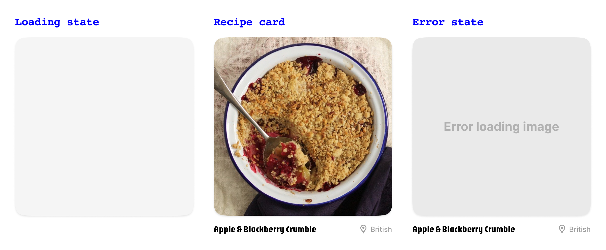

### Summary
Recipez is a simple app that displays a list of baked goods from around the world.

### Focus Areas
I prioritized two things:
- Designing a good user experience
- Learning new concepts and best practices associated with writing clean, efficient code

A good user experience is important because we want our users to use the app to address certain needs. When users are confused or become frustrated, they’re unlikely to return.

Taking the time to build a solid foundation is an investment into being a better engineer. Even though going on hour-long tangents for new concepts delayed completion, I spent extra time learning how to cache images, use dependency injection / protocols, gracefully handle errors, and write unit tests.

### Time Spent
This project took 6 days and comprised of the following chunks:

#### Design user experience
Created a simple user flow in Figma based on given requirements.

#### Define app architecture (MVVM)
I started with the following: 
- **Model:**  `Recipe` 
- **View:**  `HomeView` - screen displaying the feed of all recipes 
- **ViewModel:**  `HomeViewModel` - all the logic for `HomeView`

Additional folders that came later include `Extensions`, `Protocols`, `Services`, `Utilities`, and `Components`.

#### Create custom color theme and fonts
Created custom extensions for `Font` and `Color` for app styling, with support for light and dark mode.

#### Create views and UI components
Main views included the app loading screen and `HomeView` screen. I created a separate `Components` folder for UI components such as the `RecipeCardView`.

#### Determine flow of data
Created a data service layer that sits between view model and the database. This `RecipeDataService` is solely responsible for fetching and decoding JSON data and is injected into the `HomeViewModel`.

When data is fetched, it’s decoded into an array `recipes` of type `[Recipe]`. We then iterate over the array to display a list of recipe cards.

`RecipeCardView` is a UI component that accepts a recipe of type `Recipe` and displays the `image`, `title`, and `cuisine` properties. The `image` is conditionally rendered in the UI by first checking if there’s already a cached image of the same ID. If there is, we display the cached image. If not, we fetch and display the image from the URL.
																				
Because `AsyncImage` renders the image, there's both a loading and error state.
 

#### Implement user-facing and internal error handling
Handled network request errors by creating enum `RecipeDataError` consisting of `invalidURL`, `badServerResponse`, `malformedData`, and `emptyData` and logging them when errors are thrown.

When data is unavailable, users will see an error state in place of the feed.

#### Write unit tests
Wrote unit tests for `HomeViewModel` to verify behavior for initial state, a successful fetch, and a failed fetch.

Created a `MockRecipeDataService` with hard-coded data in place of `RecipeDataService` to limit the amount of network requests for testing purposes.

Both data services conformed to a custom `DataService` protocol which made it easy to swap between the two data service dependencices.

### Trade-offs and Decisions
Many of the trade-offs I made are considered UX nice-to-haves–things like pull down to refresh or have an flashing gray loading state for images. Because I’d need additional time to look into how these are implemented, I decided to leave them out for now.

### Weakest Part of the Project
The weakest part of the project would be lack of unit testing for image caching. Prior to this project, I didn’t know what unit tests were nor how to write one.

When writing tests for fetching recipes, I struggled with the abstraction layer of creating a mock service and what it should contain opposed to the actual data service. Ultimately, I was able to figure it out by hard-coding some recipes as well as simulating failure scenarios through an async function without actually fetching data.

When it came to writing tests for caching images, it appeared to have an extra layer of complexity due to built-in features associated with `FileManager`. I needed more time to investigate how to abstract these types of functions without actually saving files to the `FileManager`. Because I had a self-imposed deadline of a week, it’s something I decided to leave out of the project for now and look into separately.

### Additional Information
This project gave me a deeper understanding of the following concepts: 
 
**Image caching:** Implemented image caching to reduce unnecessary network calls to improve performance. 
 
**Dependency injection:** Used a protocol-based approach to decouple the data layer, making the code more easily testable. 
 
**Error handling:** Ensured internal errors are logged for better debugging and handled user-facing errors gracefully. 
 
**Unit testing:** Learned how to write unit tests to verify core functionality to improve the app's reliability. 
